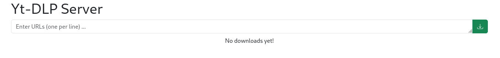

# YT-DLP as a Web / REST server

Simple Web UI to queue downloads using the great [YT-DLP](https://github.com/yt-dlp/yt-dlp)



It can also be used as a very simple REST api

## Run in Docker

```
mkdir downloads
chmod a+rwx downloads
docker run -d -p "5000:5000" -v $(pwd)/downloads:/downloads/ brenard/yt-dlp-web:latest
```

## Using the API

```
curl -XPOST -d "url=$url" http://ip:5000/add/
```

## Manual installation

```bash
# Install dependencies
apt update
apt install supervisor redis-server ffmpeg python3-venv liquidprompt git sed

# Create yt-dlp-web user
adduser --home /srv/yt-dlp-web --disabled-password yt-dlp-web

# Create python venv & configure yt-dlp-web user environment
su - yt-dlp-web
python3 -m venv venv
cat << EOF >> .bashrc

# Enable Liquid Prompt and virtual environment if in interactive shell
if [ "$PS1" ]; then
    echo "Activating virtual environment (from ~/.bashrc) ..."
    source /usr/share/liquidprompt/liquidprompt
    source ~/venv/bin/activate
fi
EOF

# Reconnect as yt-dlp-web to enable its environment
exit
su - yt-dlp-web

# Clone sources
git clone https://github.com/brenard/yt-dlp-web.git src

# Install python requirements
pip install -r src/requirements.txt

# Adjust configuration
mkdir downloads
sed -i \
  -e 's#DOWNLOAD_PATH=/downloads/#DOWNLOAD_PATH=/srv/yt-dlp-web/downloads/#' \
  -e 's#LISTEN_HOST=0.0.0.0#LISTEN_HOST=localhost#' \
  -e 's#command=#command=/srv/yt-dlp-web/venv/bin/#' \
  -e 's#SRC_PATH=/app#SRC_PATH=/srv/yt-dlp-web/src#' \
  -e 's#user=nobody#user=yt-dlp-web#' \
  src/supervisord/yt-dlp-web-server.conf \
  src/supervisord/yt-dlp-web-celery.conf
sed -i \
  -e 's#std\(out\|err\)_logfile=.*#std\1_logfile=/var/log/yt-dlp-web/server.log#' \
  -e '/^.*_logfile_maxbytes=.*/d' \
  src/supervisord/yt-dlp-web-server.conf
sed -i \
  -e 's#std\(out\|err\)_logfile=.*#std\1_logfile=/var/log/yt-dlp-web/celery.log#' \
  -e '/^.*_logfile_maxbytes=.*/d' \
  src/supervisord/yt-dlp-web-celery.conf

# Create log directory
exit
mkdir /var/log/yt-dlp-web

# Install supervisor configuration & restart service
ln -s /srv/yt-dlp-web/src/supervisord/yt-dlp-web-*.conf /etc/supervisor/conf.d/
service supervisor restart
```
